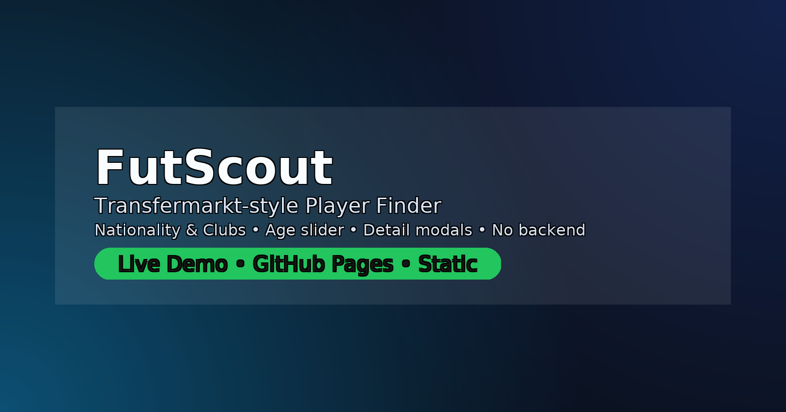

# FutScout — Transfermarkt‑style Player Finder

**Live Demo:** https://enesmyildiz.github.io/futscout/  
**Repo:** https://github.com/enesmyildiz/futscout




FutScout is a **Transfermarkt-like** player finder you can run as a **fully static website** (no backend). Search and filter players by **name, position, age, nationality, club, and market value**, view **rich detail modals**, and export/import data.

## ✨ Features
- **Multi-select filters**: Nationality & Club (select multiple).
- **Dual age slider** and value (€m) range + sorting.
- **Player detail modal**: contract, height/weight, preferred foot, basic stats.
- **Realistic imagery**: Wikipedia / FlagCDN at runtime (or local SVG placeholders).
- **CSV export** and **JSON import**; deployable on **GitHub Pages**.

## 🚀 Quick Start
1) Clone or download the repo.
```bash
git clone https://github.com/enesmyildiz/futscout
```
2) Open `index.html` locally **or** enable GitHub Pages: **Settings → Pages →** Source: *Deploy from a branch* → **Branch:** `main` → **Folder:** `/ (root)` → **Save**.  
3) (Optional) Add or update players in `app.js` (`PLAYERS` array).

## 🧩 Data Model
```js
{
  id, name, position, birth_year, age, nationality, club, value_m,
  preferred_foot, height_cm, weight_kg, contract_until,
  stats: { apps, goals, assists }
}
```

## 🔄 Keeping Clubs Up‑to‑Date
- **Manual:** edit `app.js` and change `club` for the relevant player, then commit.
- **Bulk:** use the JSON import button in the UI.
- **Auto (optional build):** a *Wiki Updater* version adds a **“Update (Wiki)”** button that tries to infer the current club from each player’s Wikipedia summary.

## 🧰 Tech Stack
- **Frontend:** HTML, CSS, Vanilla JS
- **Images:** Wikipedia Summary API (thumbnails) & FlagCDN (flags)
- **Hosting:** GitHub Pages (static)

## 🗺️ Roadmap
- Virtualized list, saved filter presets, mobile polish, performance tuning.

## 📝 License
MIT
